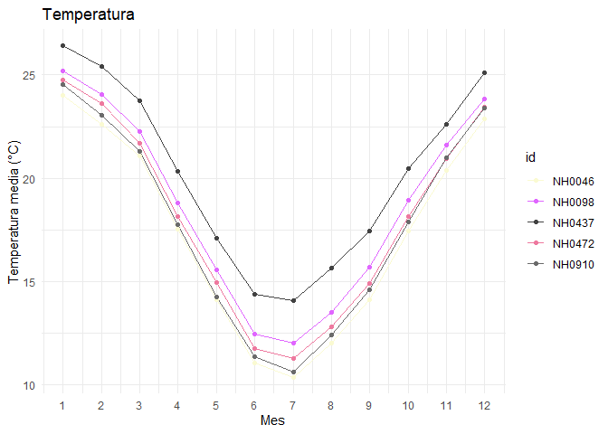

<!-- README.md is generated from README.Rmd. Please edit that file -->

# estacionespaquete

<!-- badges: start -->

[](https://lifecycle.r-lib.org/articles/stages.html#experimental)
[](https://github.com/valenmonte/estacionespaquete/actions/workflows/R-CMD-check.yaml)
[](https://app.codecov.io/gh/valenmonte/estacionespaquete?branch=master)

<!-- badges: end -->

------------------------------------------------------------------------

## 📦 Instalación

Este paquete se instala directamente desde GitHub:

\`\`\` r \# Instalar ‘remotes’ si no lo tenés
install.packages(“remotes”)

# Instalar el paquete

remotes::install_github(“valenmonte/estacionespaquete”)

# Paquete de Prueba — Estaciones Meteorológicas 

Este paquete fue desarrollado como parte del **Ejercicio Transversal** y
Su objetivo es **aprender a crear, estructurar y conectar un paquete de
R con GitHub**, no generar una herramienta de uso real.

------------------------------------------------------------------------

## 🚧 Estado del proyecto

⚠️ **Este paquete es únicamente de prueba y práctica.**  
No está pensado para ser distribuido, instalado ni utilizado en
proyectos reales.

------------------------------------------------------------------------

## 📚 Contenido:

El paquete incluye ejemplos de: - Lectura de datos meteorológicos
(`.csv`) de distintas estaciones. - Limpieza, combinación y resumen de
datos. - Cálculo de temperatura media, máxima, mínima y desvío
estándar. - Ejemplo de unión con metadatos (`left_join()`). - Uso de
funciones de `{usethis}` para crear y versionar un paquete en GitHub.

------------------------------------------------------------------------

## 👩‍💻 Autores:

Este paquete fue creado por Valentín Monteverde y Agustin Zarate,  
como ejercicio colaborativo para practicar el flujo de trabajo con Git y
GitHub.

------------------------------------------------------------------------

## 📘 Ejemplos de uso

``` r
library(dplyr) 
#> 
#> Adjuntando el paquete: 'dplyr'
#> The following objects are masked from 'package:stats':
#> 
#>     filter, lag
#> The following objects are masked from 'package:base':
#> 
#>     intersect, setdiff, setequal, union
library(estacionespaquete)
data("datos_ejemplo")
```

``` r
dplyr::glimpse(datos_ejemplo)
#> Rows: 95,681
#> Columns: 35
#> $ id                                  <chr> "NH0472", "NH0472", "NH0472", "NH0…
#> $ fecha                               <chr> "1961-07-01", "1961-07-02", "1961-…
#> $ temperatura_abrigo_150cm            <dbl> 11.10, 5.50, 6.00, NA, 12.40, 11.0…
#> $ temperatura_abrigo_150cm_maxima     <dbl> 13.4, 10.5, 10.8, NA, 14.8, 16.5, …
#> $ temperatura_abrigo_150cm_minima     <dbl> 8.8, 0.5, 1.2, 7.0, 10.0, 5.5, 4.0…
#> $ temperatura_intemperie_5cm_minima   <dbl> NA, NA, NA, NA, NA, NA, NA, NA, NA…
#> $ temperatura_intemperie_50cm_minima  <dbl> NA, NA, NA, NA, NA, NA, NA, NA, NA…
#> $ temperatura_suelo_5cm_media         <dbl> NA, NA, NA, NA, NA, NA, NA, NA, NA…
#> $ temperatura_suelo_10cm_media        <dbl> NA, NA, NA, NA, NA, NA, NA, NA, NA…
#> $ temperatura_inte_5cm                <lgl> NA, NA, NA, NA, NA, NA, NA, NA, NA…
#> $ temperatura_intemperie_150cm_minima <lgl> NA, NA, NA, NA, NA, NA, NA, NA, NA…
#> $ humedad_suelo                       <lgl> NA, NA, NA, NA, NA, NA, NA, NA, NA…
#> $ precipitacion_pluviometrica         <dbl> 0.0, 0.0, 0.0, 0.0, 0.0, 0.0, 0.0,…
#> $ granizo                             <int> 0, 0, 0, 0, 0, 0, 0, 0, 0, 0, 0, 0…
#> $ nieve                               <int> 0, 0, 0, 0, 0, 0, 0, 0, 0, 0, 0, 0…
#> $ heliofania_efectiva                 <dbl> NA, NA, NA, NA, NA, NA, NA, NA, NA…
#> $ heliofania_relativa                 <dbl> NA, NA, NA, NA, NA, NA, NA, NA, NA…
#> $ tesion_vapor_media                  <dbl> 9.8, 7.9, 7.5, 14.9, 17.2, 11.5, 8…
#> $ humedad_media                       <lgl> NA, NA, NA, NA, NA, NA, NA, NA, NA…
#> $ humedad_media_8_14_20               <int> 81, 80, 62, 93, 92, 80, 85, 70, 71…
#> $ rocio_medio                         <dbl> 6.7, 3.6, 2.9, 12.9, 15.1, 9.0, 3.…
#> $ duracion_follaje_mojado             <dbl> NA, NA, NA, NA, NA, NA, NA, NA, NA…
#> $ velocidad_viento_200cm_media        <dbl> 14.4, 4.8, 7.2, 8.8, 4.8, 14.4, 8.…
#> $ direccion_viento_200cm              <lgl> NA, NA, NA, NA, NA, NA, NA, NA, NA…
#> $ velocidad_viento_1000cm_media       <dbl> 18, 6, 9, 11, 6, 18, 11, 15, 9, 11…
#> $ direccion_viento_1000cm             <chr> NA, NA, NA, NA, NA, NA, NA, NA, NA…
#> $ velocidad_viento_maxima             <lgl> NA, NA, NA, NA, NA, NA, NA, NA, NA…
#> $ presion_media                       <dbl> NA, NA, NA, NA, NA, NA, NA, NA, NA…
#> $ radiacion_global                    <dbl> NA, NA, NA, NA, NA, NA, NA, NA, NA…
#> $ radiacion_neta                      <dbl> NA, NA, NA, NA, NA, NA, NA, NA, NA…
#> $ evaporacion_tanque                  <lgl> NA, NA, NA, NA, NA, NA, NA, NA, NA…
#> $ evapotranspiracion_potencial        <dbl> NA, NA, NA, NA, NA, NA, NA, NA, NA…
#> $ profundidad_napa                    <dbl> NA, NA, NA, NA, NA, NA, NA, NA, NA…
#> $ horas_frio                          <dbl> 0.0000000, 15.6000000, 14.5000000,…
#> $ unidad_frio                         <lgl> NA, NA, NA, NA, NA, NA, NA, NA, NA…
```

``` r
estaciones_demo <- unique(datos_ejemplo$id)[1:2]
tabla_resumen_temperatura(
  datos_ejemplo,
  estaciones = estaciones_demo
)
#> # A tibble: 2 × 3
#>   id     media desvio
#>   <chr>  <dbl>  <dbl>
#> 1 NH0472  18.0   5.94
#> 2 NH0910  17.7   6.12
```

``` r
grafico_temperatura_mensual(datos_ejemplo)
```


