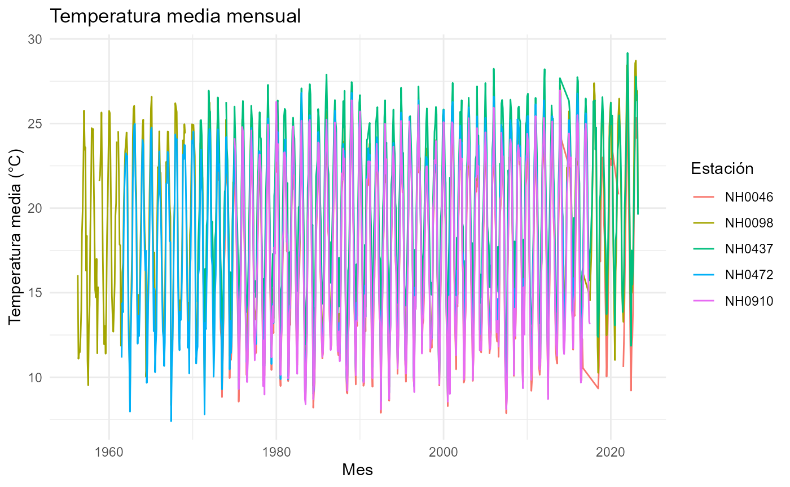

# Introducción a estacionespaquete

## Cargar los datos de ejemplo

El paquete incluye un conjunto de datos llamado `datos_ejemplo` con
mediciones de varias estaciones meteorológicas.

``` r
datos_ejemplo <- estacionespaquete::datos_ejemplo
dplyr::glimpse(datos_ejemplo)
#> Rows: 95,681
#> Columns: 35
#> $ id                                  <chr> "NH0472", "NH0472", "NH0472", "NH0…
#> $ fecha                               <chr> "1961-07-01", "1961-07-02", "1961-…
#> $ temperatura_abrigo_150cm            <dbl> 11.10, 5.50, 6.00, NA, 12.40, 11.0…
#> $ temperatura_abrigo_150cm_maxima     <dbl> 13.4, 10.5, 10.8, NA, 14.8, 16.5, …
#> $ temperatura_abrigo_150cm_minima     <dbl> 8.8, 0.5, 1.2, 7.0, 10.0, 5.5, 4.0…
#> $ temperatura_intemperie_5cm_minima   <dbl> NA, NA, NA, NA, NA, NA, NA, NA, NA…
#> $ temperatura_intemperie_50cm_minima  <dbl> NA, NA, NA, NA, NA, NA, NA, NA, NA…
#> $ temperatura_suelo_5cm_media         <dbl> NA, NA, NA, NA, NA, NA, NA, NA, NA…
#> $ temperatura_suelo_10cm_media        <dbl> NA, NA, NA, NA, NA, NA, NA, NA, NA…
#> $ temperatura_inte_5cm                <lgl> NA, NA, NA, NA, NA, NA, NA, NA, NA…
#> $ temperatura_intemperie_150cm_minima <lgl> NA, NA, NA, NA, NA, NA, NA, NA, NA…
#> $ humedad_suelo                       <lgl> NA, NA, NA, NA, NA, NA, NA, NA, NA…
#> $ precipitacion_pluviometrica         <dbl> 0.0, 0.0, 0.0, 0.0, 0.0, 0.0, 0.0,…
#> $ granizo                             <int> 0, 0, 0, 0, 0, 0, 0, 0, 0, 0, 0, 0…
#> $ nieve                               <int> 0, 0, 0, 0, 0, 0, 0, 0, 0, 0, 0, 0…
#> $ heliofania_efectiva                 <dbl> NA, NA, NA, NA, NA, NA, NA, NA, NA…
#> $ heliofania_relativa                 <dbl> NA, NA, NA, NA, NA, NA, NA, NA, NA…
#> $ tesion_vapor_media                  <dbl> 9.8, 7.9, 7.5, 14.9, 17.2, 11.5, 8…
#> $ humedad_media                       <lgl> NA, NA, NA, NA, NA, NA, NA, NA, NA…
#> $ humedad_media_8_14_20               <int> 81, 80, 62, 93, 92, 80, 85, 70, 71…
#> $ rocio_medio                         <dbl> 6.7, 3.6, 2.9, 12.9, 15.1, 9.0, 3.…
#> $ duracion_follaje_mojado             <dbl> NA, NA, NA, NA, NA, NA, NA, NA, NA…
#> $ velocidad_viento_200cm_media        <dbl> 14.4, 4.8, 7.2, 8.8, 4.8, 14.4, 8.…
#> $ direccion_viento_200cm              <lgl> NA, NA, NA, NA, NA, NA, NA, NA, NA…
#> $ velocidad_viento_1000cm_media       <dbl> 18, 6, 9, 11, 6, 18, 11, 15, 9, 11…
#> $ direccion_viento_1000cm             <chr> NA, NA, NA, NA, NA, NA, NA, NA, NA…
#> $ velocidad_viento_maxima             <lgl> NA, NA, NA, NA, NA, NA, NA, NA, NA…
#> $ presion_media                       <dbl> NA, NA, NA, NA, NA, NA, NA, NA, NA…
#> $ radiacion_global                    <dbl> NA, NA, NA, NA, NA, NA, NA, NA, NA…
#> $ radiacion_neta                      <dbl> NA, NA, NA, NA, NA, NA, NA, NA, NA…
#> $ evaporacion_tanque                  <lgl> NA, NA, NA, NA, NA, NA, NA, NA, NA…
#> $ evapotranspiracion_potencial        <dbl> NA, NA, NA, NA, NA, NA, NA, NA, NA…
#> $ profundidad_napa                    <dbl> NA, NA, NA, NA, NA, NA, NA, NA, NA…
#> $ horas_frio                          <dbl> 0.0000000, 15.6000000, 14.5000000,…
#> $ unidad_frio                         <lgl> NA, NA, NA, NA, NA, NA, NA, NA, NA…
```

``` r
dplyr::glimpse(datos_ejemplo)
#> Rows: 95,681
#> Columns: 35
#> $ id                                  <chr> "NH0472", "NH0472", "NH0472", "NH0…
#> $ fecha                               <chr> "1961-07-01", "1961-07-02", "1961-…
#> $ temperatura_abrigo_150cm            <dbl> 11.10, 5.50, 6.00, NA, 12.40, 11.0…
#> $ temperatura_abrigo_150cm_maxima     <dbl> 13.4, 10.5, 10.8, NA, 14.8, 16.5, …
#> $ temperatura_abrigo_150cm_minima     <dbl> 8.8, 0.5, 1.2, 7.0, 10.0, 5.5, 4.0…
#> $ temperatura_intemperie_5cm_minima   <dbl> NA, NA, NA, NA, NA, NA, NA, NA, NA…
#> $ temperatura_intemperie_50cm_minima  <dbl> NA, NA, NA, NA, NA, NA, NA, NA, NA…
#> $ temperatura_suelo_5cm_media         <dbl> NA, NA, NA, NA, NA, NA, NA, NA, NA…
#> $ temperatura_suelo_10cm_media        <dbl> NA, NA, NA, NA, NA, NA, NA, NA, NA…
#> $ temperatura_inte_5cm                <lgl> NA, NA, NA, NA, NA, NA, NA, NA, NA…
#> $ temperatura_intemperie_150cm_minima <lgl> NA, NA, NA, NA, NA, NA, NA, NA, NA…
#> $ humedad_suelo                       <lgl> NA, NA, NA, NA, NA, NA, NA, NA, NA…
#> $ precipitacion_pluviometrica         <dbl> 0.0, 0.0, 0.0, 0.0, 0.0, 0.0, 0.0,…
#> $ granizo                             <int> 0, 0, 0, 0, 0, 0, 0, 0, 0, 0, 0, 0…
#> $ nieve                               <int> 0, 0, 0, 0, 0, 0, 0, 0, 0, 0, 0, 0…
#> $ heliofania_efectiva                 <dbl> NA, NA, NA, NA, NA, NA, NA, NA, NA…
#> $ heliofania_relativa                 <dbl> NA, NA, NA, NA, NA, NA, NA, NA, NA…
#> $ tesion_vapor_media                  <dbl> 9.8, 7.9, 7.5, 14.9, 17.2, 11.5, 8…
#> $ humedad_media                       <lgl> NA, NA, NA, NA, NA, NA, NA, NA, NA…
#> $ humedad_media_8_14_20               <int> 81, 80, 62, 93, 92, 80, 85, 70, 71…
#> $ rocio_medio                         <dbl> 6.7, 3.6, 2.9, 12.9, 15.1, 9.0, 3.…
#> $ duracion_follaje_mojado             <dbl> NA, NA, NA, NA, NA, NA, NA, NA, NA…
#> $ velocidad_viento_200cm_media        <dbl> 14.4, 4.8, 7.2, 8.8, 4.8, 14.4, 8.…
#> $ direccion_viento_200cm              <lgl> NA, NA, NA, NA, NA, NA, NA, NA, NA…
#> $ velocidad_viento_1000cm_media       <dbl> 18, 6, 9, 11, 6, 18, 11, 15, 9, 11…
#> $ direccion_viento_1000cm             <chr> NA, NA, NA, NA, NA, NA, NA, NA, NA…
#> $ velocidad_viento_maxima             <lgl> NA, NA, NA, NA, NA, NA, NA, NA, NA…
#> $ presion_media                       <dbl> NA, NA, NA, NA, NA, NA, NA, NA, NA…
#> $ radiacion_global                    <dbl> NA, NA, NA, NA, NA, NA, NA, NA, NA…
#> $ radiacion_neta                      <dbl> NA, NA, NA, NA, NA, NA, NA, NA, NA…
#> $ evaporacion_tanque                  <lgl> NA, NA, NA, NA, NA, NA, NA, NA, NA…
#> $ evapotranspiracion_potencial        <dbl> NA, NA, NA, NA, NA, NA, NA, NA, NA…
#> $ profundidad_napa                    <dbl> NA, NA, NA, NA, NA, NA, NA, NA, NA…
#> $ horas_frio                          <dbl> 0.0000000, 15.6000000, 14.5000000,…
#> $ unidad_frio                         <lgl> NA, NA, NA, NA, NA, NA, NA, NA, NA…
tabla_resumen_temperatura(
datos = datos_ejemplo,
estaciones = c("NH0472", "NH0437", "NH0046")
)
#> # A tibble: 3 × 3
#>   id     promedio desviacion
#>   <chr>     <dbl>      <dbl>
#> 1 NH0046     17.3       5.90
#> 2 NH0437     20.2       5.77
#> 3 NH0472     18.0       5.94
grafico_temperatura_mensual(
datos = datos_ejemplo,
titulo = "Temperatura media mensual"
)
#> Warning: Removed 1 row containing missing values or values outside the scale range
#> (`geom_line()`).
```


